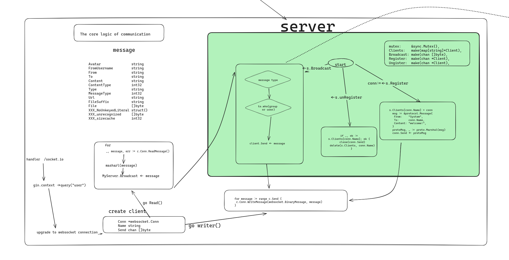

```
.
├── api
│   └── vi
├── cmd
│   └── logs
├── common
│   ├── constant
│   ├── protocol
│   ├── request
│   └── response
├── config
├── depleyment
├── global
├── initliza
├── logs
├── model
├── README.assets
├── server
├── service
├── utils
└── web
    └── static
        └── file
```
